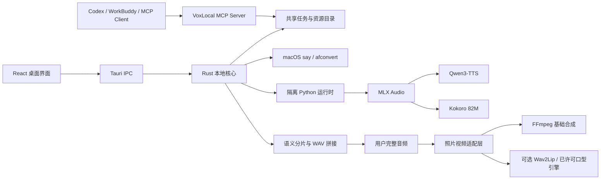
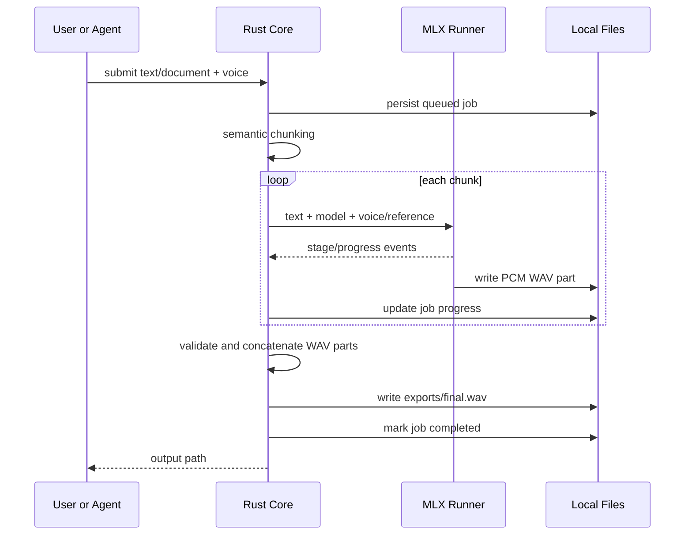

# VoxLocal 技术架构

## 总览



## 分层设计

### 表现层

React/TypeScript 负责阅读页、音色库、录制、文档库、生成历史和回收站。浏览器预览只提供界面能力；涉及模型、文件系统、Finder 或本地播放器的功能必须通过 Tauri IPC。

“口型视频”是独立页面：维护一张本地人物照片，从生成历史复用完整音频或导入本机音频，并通过统一视频任务生成 MP4。页面只依赖 `VideoEngine` 语义，不直接绑定 Wav2Lip。

前端不直接访问模型权重，也不把二进制音频放入持久状态。播放时通过 IPC 读取目标 WAV 并创建短生命周期 Blob URL。

### 桌面核心

Rust 核心负责：

- IPC 参数校验与路径边界
- 设备内存检测与策略选择
- Python 隔离运行时安装
- 后台任务创建、轮询、取消和异常恢复
- 文本语义分片
- 系统音色生成
- MLX 子进程调度
- PCM WAV 校验与拼接
- 音色、历史、缓存和回收站文件生命周期
- Finder 定位和应用资源同步
- 人物照片、导入音频和视频输出的登记式路径访问
- 基础照片视频与可选口型同步任务调度

任务状态按 JSON 文件持久化。应用异常退出后，残留的 `queued/running` 任务会在下次启动时转为 `interrupted`，避免界面永久卡在运行中。

### 模型适配层

`backend/voxlocal_engine.py` 是稳定的进程边界。Rust 写入 JSON 请求，Python 逐行输出 JSON 事件：模型下载进度、阶段变化、分片完成和错误。

公共音色路由：

- `qwen-*` → Qwen3-TTS CustomVoice
- `kokoro-*` → Kokoro 82M + 独立声音包
- `voice-*` → Qwen3-TTS Base + 用户参考音频/参考文本
- 系统音色 → macOS `say` 与 `afconvert`

## 生成管线



生成与播放是两个独立状态机。生成只负责产出文件；播放只读取已经存在的文件。切换音色后，播放器按音色寻找最近的有效历史任务，并在用户点击播放时惰性读取 WAV，兼顾直接播放与启动速度。

## 缓存设计

公共试听缓存键为：

```text
SHA-256("v1\0" + voiceId + "\0" + previewText)[0:24]
```

相同音色和相同文本永远映射到同一个文件。9 个 Qwen 默认试听随仓库分发；自定义文本和 Kokoro 试听在第一次生成后写入本地缓存。

## 资源与设备策略

| 设备统一内存 | 模型 | 分片目标 | 克隆并发 |
| --- | --- | --- | --- |
| 约 8GB | Qwen 0.6B 4-bit | 160 字 | 1 |
| 12–23GB | Qwen 0.6B 8-bit | 240 字 | 1 |
| 24GB+ | Qwen 1.7B 6-bit | 300 字 | 1 |

MLX 模型保持单实例、分片顺序执行，避免在统一内存中加载多个权重副本。公共音色资源按需下载；资源清单是 `resources/catalog.json`。

## 数据生命周期

活跃克隆音色、生成历史、系统试听缓存和回收站使用不同目录。软删除只移动文件并更新索引；清空回收站才执行永久删除。Finder 操作只允许已登记任务或 VoxLocal 缓存目录中的文件。

## Agent 与 MCP

MCP Server 使用 stdio 传输，提供健康检查、音色发现、文本/文档合成和任务查询。它不复制模型服务，而是复用桌面端的应用支持目录与 Python 运行时，因此桌面端下载过的模型可直接被 Codex 等客户端使用。

Codex 是内容与任务调度层，而不是声音模型。声音必须由本地、系统或经授权的云端声音引擎生成；完成的音频再作为视频引擎输入。未来的组合工具可以串联“生成声音 → 等待完成 → 生成视频”，同时保持两类文件各自可重试和复用。

## 可扩展点

- 新模型：在 Python Runner 增加适配器，并在资源清单声明模型和许可证。
- 新客户端：通过 MCP 调用，无需耦合 React UI。
- 新调度策略：设备画像和任务持久化已经与模型适配层解耦。
- 跨设备：未来可在 IPC/MCP 上层增加局域网队列，核心任务格式无需变化。
