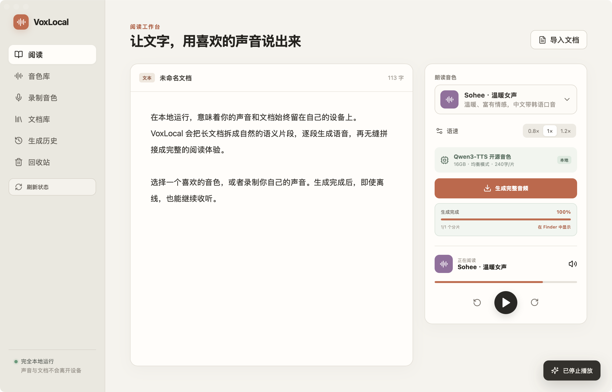

# VoxLocal

VoxLocal 是一个 macOS 优先、完全本地的文档朗读与声音克隆工具。界面使用 React，桌面能力和任务引擎由 Tauri/Rust 提供，克隆推理由 MLX 版 Qwen3-TTS 完成。



## 项目文档

- [产品介绍与使用场景](PRODUCT.md)
- [系统架构与数据流](ARCHITECTURE.md)
- [2026-08-24 产品与技术决策](docs/PRODUCT_DECISIONS_2026-08-24.md)
- [开发、调试与发布指南](DEVELOPMENT.md)
- [模型和音色资源清单](resources/catalog.json)
- [第三方模型与许可证说明](THIRD_PARTY_NOTICES.md)

## 功能

- 录制、试听、废弃和命名自己的声音
- 随机录制参考文本，以及带阶段、百分比和进度条的本地降噪优化
- 音色库分为“全部 / 公共 / 克隆”，试听文本可随机或自行编辑
- 音色支持拖拽排序、喜欢、置顶；当前使用音色优先，其次为置顶、喜欢、克隆和公共音色
- 提供 63 个公共开源音色目录：9 个 Qwen3-TTS 高质量音色与 54 个 Kokoro 轻量多语言音色
- 未安装音色显示下载图标，点击后只下载所选模型/声音包；已下载音色可离线使用
- 导入 TXT、Markdown、PDF、DOCX 和 EPUB，并保存在本地文档库
- 文档库内置中、英、日示例，支持手动创建，并可按语言与长短文本筛选
- 长文按自然标点分片，持续显示任务阶段、分片数和进度
- 生成单个 24kHz WAV，支持播放、前后跳转、取消、重试和 Finder 定位
- 生成历史只收录用户主动生成的音频；系统试听缓存单独管理，支持重命名、播放、Finder 定位和移入回收站
- 克隆音色和历史音频使用可恢复的回收站，清空后才永久删除
- 任务与音色持久化；异常关闭后的运行中任务会标记为“已中断”
- Apple Silicon 使用 MLX Qwen3-TTS 克隆声音，模型和录音不会上传
- 根据统一内存自动选择模型、分片长度和公共音色并发数
- Codex 插件与标准 MCP 工具，可供 Codex、WorkBuddy 及其他 MCP 客户端调用
- 独立“口型视频”工作台：维护一张人物照片，复用生成历史或导入音频，生成基础 MP4，并预留可替换的 Wav2Lip 适配器

## 设备策略

| 统一内存 | 模式 | 克隆模型 | 文档分片策略 |
| --- | --- | --- | --- |
| 8GB 左右 | 轻量 | Qwen3-TTS 0.6B 4-bit | 约 160 字/片 |
| 12–23GB | 均衡 | Qwen3-TTS 0.6B 8-bit | 约 240 字/片 |
| 24GB 以上 | 质量 | Qwen3-TTS 1.7B 6-bit | 约 300 字/片 |

MLX 模型保持单实例并顺序处理分片，避免在 Mac 统一内存中重复加载权重。9 个高质量音色使用 Qwen3-TTS CustomVoice 0.6B 8-bit；54 个快速音色使用 Kokoro 82M 独立声音包。应用通过内置 `uv` 创建隔离运行时，模型和声音包按用户点击下载，不在启动时获取整库。

所有依赖资源都记录在 `resources/catalog.json`。开发者可以查看本机状态或按需下载：

```bash
npm run resources -- list
npm run resources -- status
npm run resources -- download qwen-custom
npm run resources -- download qwen-clone-balanced
npm run resources -- download kokoro zf_xiaobei
npm run resources -- download kokoro --all
```

## Agent / MCP

插件位于 `plugins/voxlocal`，提供：

- `health_check`
- `list_voices`
- `synthesize_text`
- `synthesize_document`
- `get_job`

桌面端和 MCP 共用 `~/Library/Application Support/VoxLocal` 中的音色、模型、任务与导出目录。MCP 会自动发现桌面端保存的克隆音色，并使用 MLX 生成公共开源音色或克隆音色。

## 开发与验证

```bash
npm install
npm run tauri dev
```

```bash
npm run build
cd src-tauri && cargo test
cd .. && npm run check:plugin && npm run test:open-voice && npm run test:kokoro-voice && npm run test:mcp
```

只在功能测试全部通过后运行 `npm run tauri build` 生成 `.app` 和 `.dmg`。

## 隐私与授权

所有文档、参考录音和生成音频默认只保存在本机。只能克隆本人声音，或已获得明确授权的声音。公共模型来源与许可证记录在 `THIRD_PARTY_NOTICES.md`。
